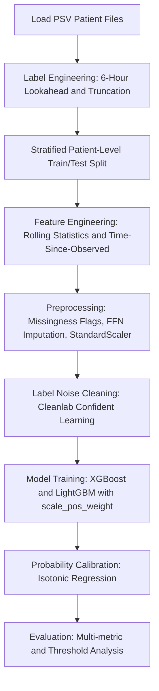

# Sepsis Early Warning System: 6-Hour Pre-Onset Clinical Prediction Pipeline

## Executive Summary
A production-grade machine learning system designed to predict clinical sepsis onset 6 hours prior to formal diagnosis in intensive care units (ICUs). Leveraging the PhysioNet Sepsis Challenge 2019 dataset (~270k hourly records across ~6.9k patients), this pipeline implements end-to-end solutions for key challenges in clinical time-series modeling: irregular sampling, severe class imbalance, label noise, and temporal data leakage. The system compares calibrated XGBoost and LightGBM models.

## Clinical Rationale and Objective
Sepsis is a life-threatening organ dysfunction caused by a dysregulated host response to infection. It is a leading cause of mortality in hospitals and ICUs worldwide. Clinical studies show that every hour of delay in administering antibiotics after the onset of sepsis-related hypotension increases mortality by 7.6%. 

The primary objective of this project is to develop an early warning system that:
1. Predicts sepsis onset 6 hours before physician diagnosis (the 6-hour clinical window).
2. Minimizes alarm fatigue in clinical staff (optimizing precision and calibration).
3. Evaluates models using clinically relevant metrics (AUPRC and calibrated probabilities rather than naive AUROC or accuracy).

## System Architecture and Pipeline Flow
The data processing and training pipeline follows a strict, sequential architecture to prevent data leakage and handle clinical data challenges:



## Clinical Data Challenges and Engineering Solutions

| Clinical Challenge | Technical Consequence | Engineering Solution |
| :--- | :--- | :--- |
| **Temporal Data Leakage** | Optimistic bias during offline testing; failure in production. | Strict patient-level train/test split. Rolling features computed using shift(1) to look only backward. Scalers and medians fit on training set only. |
| **Highly Irregular Sampling** | Sparse features with high rate of missing values (up to 95% on certain labs). | Patient-level forward-fill (FFill) to propagate the most recent observation, followed by global median imputation fit on training data. Binary missingness flags added prior to imputation to capture the clinical diagnostic signal of test ordering. |
| **Mislabeled Data / Diagnostic Noise** | Noisy training signals from subjective physician diagnoses. | cleanlab-based Confident Learning via out-of-fold predictions of a balanced Random Forest to detect and filter out-of-distribution training labels (0.11% of labels cleaned). |
| **Extreme Class Imbalance** | Naive classifiers predict 0 for all classes. Accuracy is misleadingly high (98.85%). | Use of scale_pos_weight in GBDTs, optimizing Average Precision (AUC-PR) as early stopping criteria, and evaluating with AUPRC and confusion matrices. |
| **Poorly Calibrated Probabilities** | Probability outputs do not reflect true clinical risk. | Isotonic regression calibration via 5-fold cross-validation (CalibratedClassifierCV) to ensure model outputs reflect true clinical prevalence. |

---

## Machine Learning Pipeline Breakdown

### 1. Label Engineering
PhysioNet labels clinical sepsis onset using `SepsisLabel` = 1.
For early prediction, the target label `label_6h` is set to 1 for the 6 hours preceding the first recorded `SepsisLabel` = 1.
To simulate a real-world deployment where post-onset data is irrelevant and potentially leaking, all records from the hour of onset (T) and onward are truncated (discarded).
For patients who never develop sepsis, `label_6h` is set to 0 across all ICU hours.

### 2. Patient-Level Splitting
To prevent leakage from individual patient trajectories:
- All patient files are split 80% for training and 20% for testing.
- Stratification is applied based on whether a patient ever develops sepsis (`label_6h` is positive at any time).
- This guarantees no overlapping patient histories between the training and testing sets.

### 3. Feature Engineering
Physiological time-series contain critical dynamic signatures. The pipeline generates:
- **Rolling Statistics**: Mean, standard deviation, minimum, and maximum calculated over a rolling 6-hour window. Crucially, the rolling window is shifted by 1 hour (`.shift(1)`) to ensure the current hour's measurements are excluded, preventing future-data leakage.
- **Time-Since-Last-Observation**: For sparse laboratory tests (e.g., Lactate, WBC, Platelets), a counter tracks the number of hours since the test was last ordered. This feature captures clinical intent: the act of a physician ordering a test often correlates with patient deterioration.
- **ICU Length of Stay (ICULOS)**: Included as a feature to capture temporal baseline risk.

### 4. Missingness and Imputation
Clinical labs are not ordered hourly. The pipeline handles missingness:
- **Missingness Indicators**: Pre-imputation binary columns are created for each physiological/lab column, set to 1 if the value was missing and 0 if it was observed.
- **Forward-Fill (FFill)**: Inside each patient's group, missing values are forward-filled, representing the clinician's current knowledge (the last available lab value).
- **Median Imputation**: Any remaining missing values (prior to the first measurement) are filled with the training set medians.

### 5. Label Noise Correction (cleanlab)
Noisy labels are common in medical records due to varying clinical definitions or delayed documentation.
- The pipeline trains a Random Forest Classifier with balanced class weights.
- Cleanlab's Confident Learning calculates out-of-fold probabilities to identify instances where the clinician-assigned label contradicts the model's confident prediction.
- Conflicting training records are removed (241 noisy samples, or 0.11%, in our dataset). Test labels remain unmodified to ensure clean, unbiased evaluation.

### 6. GBDT Training and Probability Calibration
We compare two Gradient Boosted Decision Tree (GBDT) architectures:
- **XGBoost Classifier**: Standard robust gradient boosting framework.
- **LightGBM Classifier**: Leaf-wise tree growth optimized for speed and performance on tabular datasets.
- Both models use `scale_pos_weight = 88.65` to account for class imbalance (approx. 1:88 positive-to-negative ratio).
- Models are tuned using early stopping (30 rounds) based on validation Average Precision (AUPRC).
- Since cost-sensitive boosting distorts probability estimates, we apply **Isotonic Regression Calibration** using 5-fold cross-validation. This maps GBDT outputs to true risk probabilities.

---

## Experimental Results and Evaluation

The models were trained on 211,477 samples and evaluated on an independent test set of 52,648 samples.

### Performance Summary

| Model | AUROC | AUPRC | Calibration Strategy |
| :--- | :--- | :--- | :--- |
| **XGBoost** | 0.7288 | 0.0418 | Isotonic Regression (5-fold CV) |
| **LightGBM** | 0.7286 | 0.0446 | Isotonic Regression (5-fold CV) |

### The Calibration Paradox in Rare Event Detection

A critical observation from the threshold analysis shows that at standard thresholds (0.30, 0.40, 0.50, 0.60), both models yield 0.00 Precision, Recall, and F1-scores.

This is a clinical expectation rather than a failure:
1. **Low Prevalence**: Sepsis label prevalence in this dataset is 1.15%.
2. **Effect of Calibration**: Calibration maps model outputs to reflect true clinical probabilities. Therefore, the calibrated probability rarely exceeds 0.20.
3. **Decision Thresholds**: Using a standard threshold of 0.50 means the model will never alert. For clinical utility, the threshold must be tuned downward (e.g., to 0.02 or 0.05) to match the low baseline prevalence. This balances the trade-off between sensitivity (early alert) and alarm fatigue (false alerts).

---

## Directory Structure

```
sepsis-prediction-main/
├── data/
│   ├── .gitkeep                 # Keeps data directory structure in VCS
│   └── training_setA/           # Raw .psv patient files (locally stored, git-ignored)
├── notebooks/
│   └── full_pipeline.ipynb      # Jupyter walkthrough of the pipeline
├── outputs/
│   ├── calibration_curve.png    # Combined calibration plot
│   ├── confusion_matrix_*.png   # Confusion matrices for evaluated models
│   ├── xgboost_model.joblib     # Serialized calibrated XGBoost model
│   ├── lightgbm_model.joblib    # Serialized calibrated LightGBM model
│   └── results.txt              # Results summary log
├── src/
│   ├── __init__.py
│   ├── calibration.py           # Isotonic and Platt scaling probability calibration
│   ├── evaluate.py              # Performance evaluation and plot generation
│   ├── features.py              # Backward-looking rolling and observation-interval features
│   ├── label_engineering.py     # 6-hour lookahead labeling and clinical truncation
│   ├── label_noise.py           # Cleanlab integration for confident learning
│   ├── load_data.py             # PSV loader and dataset statistics compiler
│   ├── model.py                 # XGBoost and LightGBM model definitions
│   └── preprocessing.py         # Imputation, missingness tracking and scaler pipelines
├── .gitignore                   # Version control exclusions
├── main.py                      # Pipeline orchestration entry point
└── requirements.txt             # Dependency specification
```

---

## Getting Started

### Prerequisites
Ensure Python 3.9+ is installed.

### Installation
1. Clone the repository:
```bash
git clone https://github.com/Waqar-743/Sepsis-Prediction.git
cd Sepsis-Prediction
```

2. Install dependencies:
```bash
pip install -r requirements.txt
```

### Dataset Setup
Download the PhysioNet Sepsis Challenge 2019 dataset. Place the patient `.psv` files under `data/training_setA/` such that:
```
data/
└── training_setA/
    ├── p000001.psv
    ├── p000002.psv
    └── ...
```

### Running the End-to-End Pipeline
Run the main pipeline script:
```bash
python main.py
```
This runs the entire flow, prints statistics, trains and calibrates the models, and writes the metric summaries and plots into the `outputs/` directory.

---

## Model Serialization
The final trained models are saved in the `outputs/` directory using `joblib`. These models can be loaded into production inference pipelines:
```python
import joblib
xgboost_model = joblib.load("outputs/xgboost_model.joblib")
lightgbm_model = joblib.load("outputs/lightgbm_model.joblib")
```

---

## License and Data Policy
This source code is to use for any purpose
