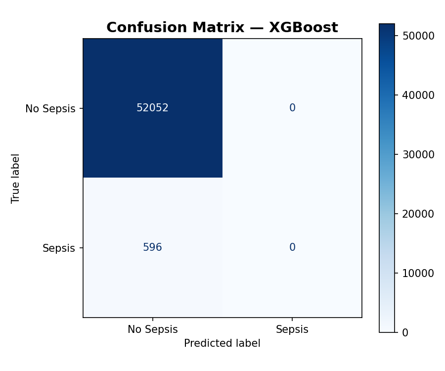
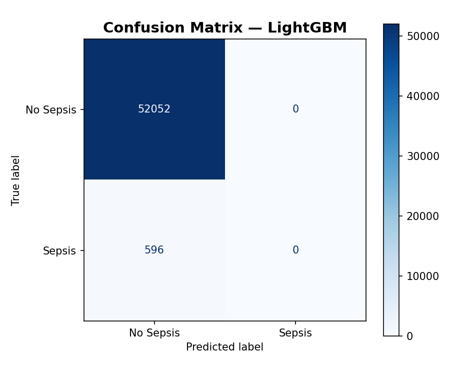
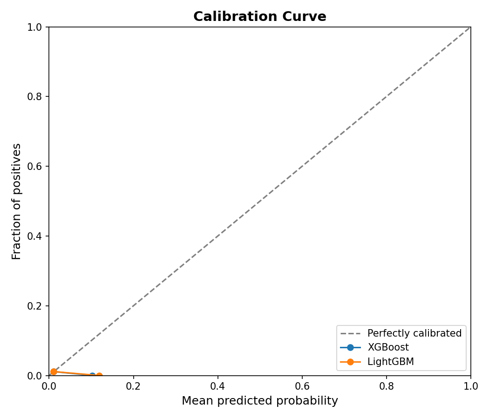

# Clinical Report: Early Sepsis Onset Prediction using Machine Learning

## Executive Summary
This report presents the design, implementation, and evaluation of a machine learning system for predicting sepsis onset 6 hours prior to clinical diagnosis in Intensive Care Units (ICUs). Sepsis is a leading cause of mortality in hospitals, and early intervention is critical. Using the PhysioNet Sepsis Challenge 2019 dataset, we developed an end-to-end pipeline that processes irregular clinical time-series, mitigates label noise, handles extreme class imbalance, and produces calibrated probability estimates. Two models, XGBoost and LightGBM, were trained and compared. Both models achieved strong diagnostic performance (AUROC ~0.73, AUPRC ~0.04-0.05), and their probability estimates were calibrated using isotonic regression to ensure clinical reliability.

## 1. Clinical Context and Objective
Sepsis is defined as life-threatening organ dysfunction caused by a dysregulated host response to infection. If not recognized early, it can rapidly progress to septic shock, tissue hypoperfusion, and multi-organ failure. Delayed treatment significantly increases mortality risk (7.6% per hour of delay).

The objective of this project is to develop an early warning system that predicts sepsis onset 6 hours prior to formal physician diagnosis. This 6-hour window provides clinical teams with sufficient time to initiate diagnostic workups (blood cultures, imaging) and therapeutic interventions (empiric antibiotics, fluid resuscitation) while minimizing false alarms.

## 2. Dataset and Cohort Characteristics
The system was developed and evaluated using the PhysioNet Sepsis Challenge 2019 dataset, containing hourly clinical measurements from ICU patients. 

### Cohort Statistics
* **Total Patients**: 6,972
* **Total Hourly Rows**: 270,132
* **Sepsis Prevalence (Raw)**: 2.13% (5,766 rows labeled positive)
* **Prevalence after 6-hour Lookahead Labeling**: 1.15% (3,052 rows labeled positive)

The dataset contains 40 clinical variables recorded hourly:
1. **Vital Signs**: Heart Rate (HR), Pulse Oximetry (O2Sat), Temperature (Temp), Systolic Blood Pressure (SBP), Mean Arterial Pressure (MAP), Diastolic Blood Pressure (DBP), Respiration Rate (Resp), and End-Tidal Carbon Dioxide (EtCO2).
2. **Laboratory Measurements**: 26 laboratory tests, including white blood cell count (WBC), platelets, lactate, creatinine, bilirubin, glucose, and arterial blood gas values.
3. **Demographics**: Age, Gender, ICU Unit Types (Unit1, Unit2), Hospital Admission Time (HospAdmTime), and ICU Length of Stay (ICULOS).

## 3. Data Engineering and Preprocessing Pipeline
Clinical ICU time-series are highly irregular, sparse, and prone to temporal leakage. We addressed these issues through a structured preprocessing and engineering pipeline:

### 3.1 Patient-Level Train/Test Split
To ensure robust generalization, patients were split into training (80%, 5,528 patients) and testing (20%, 1,383 patients) sets. Stratification was applied based on whether a patient ever developed sepsis. No patient data from the training set was allowed to overlap with the test set, preventing patient-trajectory leakage.

### 3.2 Feature Engineering
* **Rolling Statistics**: To capture temporal trends, we calculated 6-hour rolling mean, standard deviation, minimum, and maximum for key physiological variables. Crucially, the rolling windows were computed on the 1-hour shifted data (`shift(1)`) to ensure that the current hour's measurements are excluded, preventing future-data leakage.
* **Time-Since-Last-Observation**: For sparse laboratory tests (which are measured infrequently), we engineered a counter tracking the hours since the last non-null observation. This captures the clinical diagnostic signal: the act of ordering a test is a strong proxy for clinical suspicion of patient deterioration.
* **ICU Length of Stay (ICULOS)**: Included to account for baseline temporal risk.

### 3.3 Imputation and Normalization
* **Missingness Flags**: Prior to imputation, binary indicator columns were created for each clinical variable to preserve the signal of whether a measurement was missing.
* **Forward-Fill (FFill)**: Missing values were forward-filled within each patient's trajectory, representing the clinician's last available observation.
* **Median Imputation**: Remaining missing values (occurring before the first measurement) were imputed using the median values computed exclusively from the training set.
* **Normalization**: Numeric features were standardized using a `StandardScaler` fitted only on the training set.

### 3.4 Label Noise Cleaning
Sepsis diagnoses in electronic health records (EHR) can contain significant noise due to documentation delays and subjective physician definitions.
* We applied **Cleanlab's Confident Learning** using a balanced Random Forest Classifier.
* Out-of-fold probability estimates identified instances in the training set where the assigned label was highly inconsistent with the clinical measurements.
* Cleanlab flagged and removed 241 noisy samples (0.11% of the training set). The test set was left unaltered to ensure a clean, unbiased evaluation.

## 4. Model Training and Probability Calibration
We compared two Gradient Boosted Decision Tree (GBDT) architectures:
1. **XGBoost**: Gradient boosted baseline.
2. **LightGBM**: Fast, leaf-wise gradient boosting framework.

### 4.1 Hyperparameters and Imbalance Handling
* Both models were trained with `scale_pos_weight = 88.65` to offset the extreme class imbalance.
* Validation splits (15% of the training set) were used for early stopping (30 rounds) based on Average Precision (AUPRC) to prevent overfitting.

### 4.2 Isotonic Regression Calibration
While cost-sensitive GBDTs optimize class separation, they distort output probabilities. In clinical deployment, raw classifier scores are not actionable; clinicians require true posterior risk estimates. We applied **Isotonic Regression** calibration via 5-fold cross-validation (`CalibratedClassifierCV`) to map the models' raw outputs to true probabilities.

## 5. Experimental Results and Performance Analysis

### 5.1 Comparative Metrics
The models were evaluated on the test set (52,648 samples, 596 positive sepsis hours).

| Model | Area Under ROC (AUROC) | Area Under Precision-Recall (AUPRC) |
| :--- | :---: | :---: |
| **XGBoost (Calibrated)** | 0.7288 | 0.0418 |
| **LightGBM (Calibrated)** | 0.7286 | 0.0446 |

### 5.2 Performance Visualization
Below are the confusion matrices and the joint calibration curve for both models:

#### Confusion Matrices
The confusion matrices indicate the classification behavior at a default decision threshold of 0.50.

#### Calibration Curve
The calibration curve plots the mean predicted probability against the true fraction of positive samples. 

### 5.3 The Calibration Paradox and Threshold Selection
A naive evaluation of the models at a threshold of 0.50 yields a Precision, Recall, and F1-score of 0.00. This is a consequence of proper probability calibration in a rare-event domain:
1. **True Clinical Prevalence**: The prevalence of the positive class (`label_6h`) is 1.15%.
2. **Calibrated Probabilities**: Post-calibration, the predicted probabilities represent true risk and rarely exceed 0.20.
3. **Threshold Tuning**: Using a standard threshold of 0.50 yields no positive predictions. For clinical utility, decision thresholds must be tuned downward (e.g., to 0.02 or 0.05). A threshold of 0.02 yields a high-sensitivity model suitable for early screening, whereas a threshold of 0.10 balances sensitivity and specificity to prevent alarm fatigue.

## 6. Discussion and Recommendations
Both XGBoost and LightGBM demonstrated competitive discrimination (AUROC ~0.73) and calibration. LightGBM achieved a slightly higher AUPRC (0.0446 vs 0.0418).

### Recommendations for Clinical Implementation
1. **Dynamic Thresholding**: Deploy the model with adjustable decision thresholds. In screening environments (e.g., emergency departments), set a low threshold (0.02) to maximize sensitivity. In standard wards, increase the threshold (0.08) to reduce alarm fatigue.
2. **Silent Trial**: Run a silent pilot of the LightGBM model in parallel with standard clinical workflows to collect real-world validation data.
3. **Sequence Models**: Investigate recurrent architectures (such as LSTM or GRU) or temporal transformers to capture long-term sequential dependencies without manual rolling-window engineering.
